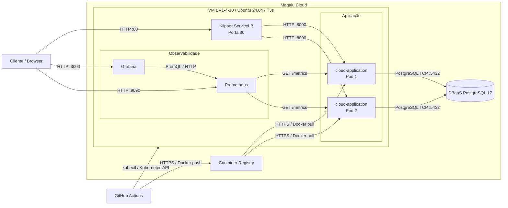

# Arquitetura da Solução

## Visão geral

A solução consiste em uma API de pedidos desenvolvida com FastAPI e implantada na Magalu Cloud sobre um cluster K3s single-node.

A aplicação é executada com duas réplicas, utiliza PostgreSQL gerenciado para persistência, Container Registry para armazenamento das imagens Docker, GitHub Actions para CI/CD e kube-prometheus-stack para observabilidade com Prometheus e Grafana.

## Diagrama de arquitetura

## Componentes da arquitetura

| Componente | Tecnologia / Serviço | Função |
|---|---|---|
| API | FastAPI em K3s — 2 réplicas | Processa as requisições HTTP de pedidos e itens |
| Orquestração | K3s em VM BV1-4-10 | Executa e gerencia os containers da aplicação |
| Banco de dados | DBaaS PostgreSQL 17 | Persiste pedidos e itens fora do ciclo de vida dos pods |
| Imagens | Magalu Cloud Container Registry | Armazena as imagens Docker da aplicação |
| Tráfego externo | Klipper ServiceLB | Expõe a aplicação externamente e distribui tráfego entre as réplicas |
| CI/CD | GitHub Actions | Automatiza testes, build, push da imagem e deploy |
| Métricas | Prometheus | Coleta métricas da aplicação e do cluster |
| Visualização | Grafana | Exibe dashboards de infraestrutura e aplicação |
| Descoberta de métricas | ServiceMonitor / Prometheus Operator | Configura a coleta do endpoint `/metrics` da aplicação |
| Segredos | GitHub Secrets e Kubernetes Secrets | Armazenam credenciais do Registry, kubeconfig e `DATABASE_URL` |

## Requisitos não-funcionais

| Requisito | Como medir | Alvo |
|---|---|---|
| Disponibilidade | Erros 5xx e uptime das probes no Grafana | 99,5% mensal |
| Latência | P95 das requisições HTTP a partir das métricas da aplicação | P95 < 500 ms |
| Escalabilidade | Teste de carga + `rate(http_requests_total)` | 300 req/s sem degradação significativa |
| Resiliência | Exclusão manual de um pod e observação da recuperação | Manter 2 réplicas após a recuperação automática |
| Persistência | Criação e consulta de pedidos após recriação de pods | Nenhuma perda de dados persistidos |
| Observabilidade | Targets do ServiceMonitor no Prometheus | Todos os pods da aplicação em estado `UP` |
| Custo | VM + DBaaS + Registry + IP público | Manter dentro do orçamento definido para o ambiente |

## Estilo arquitetural

A solução segue o estilo de **monolito em camadas**, com separação lógica entre apresentação/API, regras de serviço e persistência de dados.

A aplicação é distribuída como um único artefato de software, porém executada em duas réplicas dentro do Kubernetes. Dessa forma, mantém-se a simplicidade de um monólito ao mesmo tempo em que são utilizados recursos de escalabilidade horizontal e recuperação automática da plataforma.

A aplicação também possui características **stateless**, pois os dados permanentes não são armazenados dentro dos containers. O estado é mantido externamente no DBaaS PostgreSQL.

Caso novos domínios independentes cresçam significativamente, como notificações ou processamento assíncrono, eles poderão futuramente ser extraídos para serviços separados.

## Trade-offs

| Aspecto | Decisão tomada | Alternativa não escolhida | Motivo da escolha |
|---|---|---|---|
| Deploy | K3s em VM | Kubernetes gerenciado | Menor custo e simplicidade para o escopo do projeto |
| Banco | DBaaS PostgreSQL | PostgreSQL dentro do cluster | Persistência independente dos pods e menor esforço de administração |
| CI/CD | GitHub Actions | Deploy manual | Consistência, automação e rastreabilidade |
| Réplicas | 2 pods | 1 pod | Disponibilidade mínima e demonstração de recuperação automática |
| API | FastAPI / Python | Node.js, Go ou Java | Produtividade e simplicidade de desenvolvimento |
| Observabilidade | Prometheus + Grafana | Monitoramento manual | Coleta contínua de métricas e dashboards reutilizáveis |
| Persistência | Banco externo ao cluster | Volume local no K3s | Evita vincular os dados ao ciclo de vida da VM ou dos pods |

## Escalabilidade

A aplicação é stateless e, portanto, pode escalar horizontalmente por meio do aumento do número de réplicas.

Atualmente são utilizadas **duas réplicas fixas**. Um próximo passo natural seria configurar um **Horizontal Pod Autoscaler (HPA)**, por exemplo:

- mínimo de 2 pods
- máximo de 6 pods
- utilização de CPU alvo de 70%

Entretanto, aumentar somente o número de réplicas da API não elimina possíveis gargalos do banco de dados. Caso o PostgreSQL se torne o principal limitador, seria necessário avaliar otimização de consultas, criação de índices, aumento da capacidade do DBaaS ou utilização de cache.

## Pontos de melhoria

| Melhoria | Por quê |
|---|---|
| HTTPS / TLS | Toda API em produção deve ser acessada por conexão criptografada |
| Autoscaler (HPA) | Ajusta automaticamente o número de pods conforme a carga |
| Versionamento de API | Permite evoluir endpoints sem quebrar clientes existentes |
| Rate limiting | Evita abuso e protege a aplicação e o banco |
| Cache com Redis | Reduz consultas repetidas ao PostgreSQL |
| Migrações com Alembic | Controla a evolução do schema do banco |
| Testes de carga | Valida comportamento sob alto tráfego |
| Kubernetes gerenciado | Elimina o single point of failure do cluster single-node |
| Alertas | Permitem notificação automática de falhas e degradações |
| HTTPS no Grafana e Prometheus | Reduz a exposição de interfaces administrativas via HTTP |

## Custos

Os principais recursos com impacto de custo na solução são:

| Recurso | Configuração | Observação |
|---|---|---|
| VM K3s | BV1-4-10 | Cobrança por tempo de uso |
| DBaaS PostgreSQL | PostgreSQL 17 | Cobrança por tempo de uso |
| Container Registry | Imagens Docker | Custo associado ao armazenamento |
| IP público | Associado à VM | Conforme política de preços vigente da Magalu Cloud |

Os valores devem ser consultados na tabela ou calculadora de preços vigente da Magalu Cloud antes de uma estimativa de produção.

## Conclusão

A arquitetura construída atende ao objetivo do projeto ao disponibilizar uma aplicação em nuvem com deploy automatizado, persistência gerenciada, múltiplas réplicas, recuperação automática e observabilidade.

A principal limitação atual é o uso de um cluster K3s single-node, pois a VM representa um ponto único de falha. Em um cenário de produção com requisitos mais elevados de disponibilidade, a evolução natural seria adotar Kubernetes gerenciado ou uma arquitetura com múltiplos nós, além de HTTPS, autoscaling, alertas e controles adicionais de segurança.